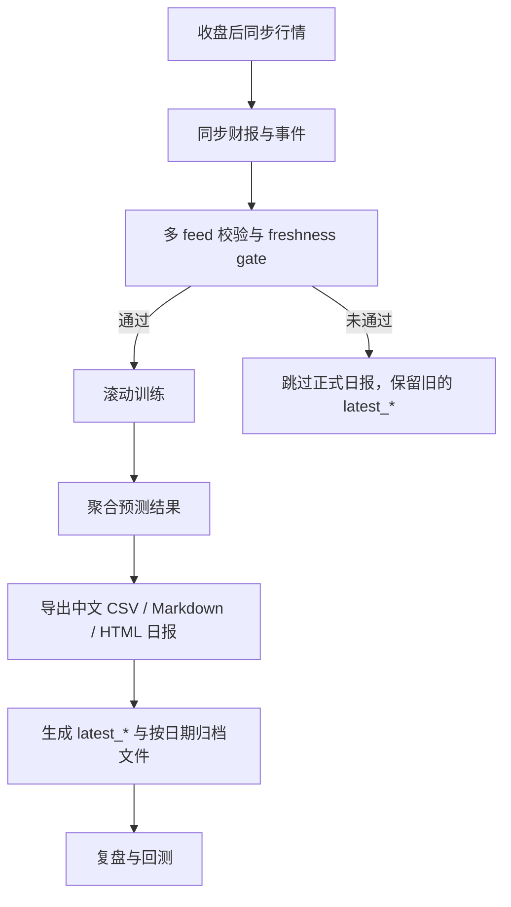

# qlib-research-workbench

[](https://github.com/ioiochen11/qlib-research-workbench/actions/workflows/ci.yml)


一个面向 A 股研究流程的 Qlib 工作台，用来做收盘后数据校验、滚动训练、推荐日报生成，以及复盘和回测。

仓库首页现在以中文说明为主，更完整的中文文档见 [docs/README_CN.md](docs/README_CN.md)。

当前默认工作流是：

- 目标股票池默认是 `沪深300`
- 训练和推荐都只保留 `30 元以下` 的股票
- 收盘后同步 `market / fundamentals / events`
- freshness gate 不通过时，不覆盖已有 `latest_*` 日报
- 生成全中文的 `CSV / Markdown / HTML` 推荐日报，方便人工核对

这个项目最初是对 [`touhoufan2024/qlibAssistant`](https://github.com/touhoufan2024/qlibAssistant) 的一次聚焦重构，后来逐步扩展成一个更适合公开维护的研究型仓库，补上了 CLI、测试、文档、CI，以及收盘后多 feed 校验流程。

如果这个项目对你有帮助，欢迎点个 Star。

## 一眼看懂

- 收盘后多 feed 校验流水线，包含 `raw / gold / manifests`
- 本地 Qlib 数据工作流，不再依赖别人每天更新 release 数据包
- 基于 `Alpha158` 的滚动训练与推荐生成
- 面向人工核对的中文推荐日报，而不只是 notebook 输出
- 内置 freshness gate，脏数据或陈旧数据不会污染 `latest_*`
- 可选的 `ClawTeam` 收盘后 runner，带任务看板、步骤日志和 summary 快照

## 为什么做这个仓库

`qlibAssistant` 最有价值的点，是把 Qlib 从“一次性的 notebook”变成“每天可运行的研究流水线”。这个仓库保留了这个方向，但把它整理成一个更容易验证、扩展和公开维护的工作台。

它现在已经具备：

- 远端数据探测、下载、解压和本地校验
- 基于 AkShare 的日频同步，不用再等第三方包更新
- `market / fundamentals / events` 的收盘后多 feed 同步与校验
- freshness gate，保证脏数据不会进入正式日报
- 可选的上证 180 股票池刷新和本地缓存回退
- 本地 Qlib 初始化与特征读取 smoke check
- 带样本级 `<= 30 元` 过滤的滚动训练
- 预测聚合、每日选股报表、推荐价位计划
- 全中文的 CSV / Markdown / HTML 推荐日报
- `daily-run` 和 `clawteam-runner` 两套收盘后执行方式
- 复盘、TopK 回测、`mlruns` 备份恢复
- 单元测试、文档、Makefile 快捷命令和 GitHub Actions CI

## 工作流



这个仓库同时解决两件事：

- 每天收盘后生成候选股票与推荐日报
- 每天核对推荐价位与下一交易日真实价格行为是否一致

## 快速开始

先安装轻量依赖：

```bash
python3 -m pip install -r requirements.txt
```

如果你要跑训练和模型相关流程，再安装 Qlib 依赖：

```bash
python3 -m pip install -r requirements-qlib.txt
```

也可以直接按可编辑模式安装：

```bash
python3 -m pip install -e .
python3 -m pip install -e .[qlib]
```

## 第一次运行

先探测远端数据源：

```bash
python3 -m qlib_assistant_refactor probe
```

查看本地数据状态：

```bash
python3 roll.py data status
```

如果你要跑 `上证180`，先刷新股票池文件；默认 `沪深300` 可以直接同步：

```bash
.venv/bin/python roll.py data refresh-sse180
.venv/bin/python roll.py data sync-akshare --start-date 2026-03-19 --end-date 2026-03-20
.venv/bin/python roll.py data sync-market --start-date 2026-03-19 --end-date 2026-03-20
.venv/bin/python roll.py data sync-fundamentals --date 2026-03-20
.venv/bin/python roll.py data sync-events --date 2026-03-20
.venv/bin/python roll.py data verify-freshness --date 2026-03-20
```

确认 Qlib 能正常读取本地数据：

```bash
.venv/bin/python roll.py data qlib-check
```

跑一次最小训练：

```bash
.venv/bin/python roll.py train smoke
```

生成报表：

```bash
.venv/bin/python roll.py model report
.venv/bin/python roll.py model review
.venv/bin/python roll.py model backtest
```

运行完整的收盘后流程：

```bash
.venv/bin/python roll.py daily-run
.venv/bin/python roll.py clawteam-runner
```

## 常用命令

数据：

```bash
python3 -m qlib_assistant_refactor probe
python3 -m qlib_assistant_refactor status
python3 -m qlib_assistant_refactor verify
python3 -m qlib_assistant_refactor qlib-check
python3 roll.py data update --proxy A
python3 roll.py data refresh-sse180
python3 roll.py data sync-akshare
python3 roll.py data sync-market
python3 roll.py data sync-fundamentals
python3 roll.py data sync-events
python3 roll.py data verify-freshness
python3 roll.py data show-manifest --date 2026-03-20
```

训练：

```bash
.venv/bin/python roll.py train plan
.venv/bin/python roll.py train smoke
.venv/bin/python roll.py train start --limit 1
.venv/bin/python roll.py train list-experiments
```

分析：

```bash
.venv/bin/python roll.py model ls --all
.venv/bin/python roll.py model top --limit 10
.venv/bin/python roll.py model recommendations --date 2026-03-19 --limit 10 --max-price 30
.venv/bin/python roll.py model save-recommendations --date 2026-03-19 --limit 10 --max-price 30
.venv/bin/python roll.py model recommendation-report --date 2026-03-19 --limit 10 --max-price 30
.venv/bin/python roll.py model save-recommendation-report --date 2026-03-19 --limit 10 --max-price 30
.venv/bin/python roll.py model recommendation-html --date 2026-03-19 --limit 10 --max-price 30
.venv/bin/python roll.py model save-recommendation-html --date 2026-03-19 --limit 10 --max-price 30
.venv/bin/python roll.py model recommendation-spotlight --date 2026-03-20 --limit 3 --max-price 30
.venv/bin/python roll.py model save-recommendation-spotlight-html --date 2026-03-20 --limit 3 --max-price 30
.venv/bin/python roll.py model report
.venv/bin/python roll.py model review
.venv/bin/python roll.py model backtest
.venv/bin/python roll.py daily-run
.venv/bin/python roll.py clawteam-runner
```

如果你主要是做人工核对，`model recommendations` 是最适合直接看的命令，它会展示：

- 推荐股票及名称
- 原始价格尺度下的买入区间、突破价、止损和止盈
- 下一交易日的 OHLC 价格
- 是否真正触及买入区间或突破价
- 一个便于快速人工核对的验证状态

如果你希望比宽表更好读，可以用 `model recommendation-report` 或 `save-recommendation-report` 导出 Markdown 日报。

如果你希望直接在浏览器里查看，可以用 `model recommendation-html` 或 `save-recommendation-html` 导出独立 HTML 页面。

如果你只想看最重要的几只候选票，可以用 `model recommendation-spotlight` 或 `save-recommendation-spotlight-html` 导出 Top3 解读页。

`daily-run` 会串起这条主链：

- `data sync-market`
- `data sync-fundamentals`
- `data sync-events`
- `data verify-freshness`
- `train start`
- `model report`
- `model save-recommendations`
- `model save-recommendation-report`
- `model save-recommendation-html`

它会同时写出按日期归档的文件和稳定命名的 `latest_*` 文件，目录都在 `~/.qlibAssistant/analysis` 下，方便本机自动化每天覆盖最新日报，同时保留历史归档。如果股票池是 `上证180`，它还会先刷新本地 `sse180.txt`。

如果 freshness gate 失败，`daily-run` 会跳过训练和正式出报，并保留原有 `latest_*` 文件不动，同时把原因写到 `~/.qlibAssistant/daily_sync/manifests/YYYY-MM-DD/`。

如果你想要同一条收盘后流程，但带任务级追踪和日志，运行：

```bash
.venv/bin/python roll.py clawteam-runner
```

它会为这次运行创建一个 ClawTeam team，逐步更新 task 状态，把每一步的日志写到 `.clawteam-workbench/runs/<team>/logs/`，并保存 summary JSON 供后续检查。

## 可直接打开的输出

成功运行后，最有用的几个文件是：

- `~/.qlibAssistant/analysis/latest_recommendations.csv`
- `~/.qlibAssistant/analysis/latest_recommendation_report.html`
- `~/.qlibAssistant/analysis/latest_recommendation_spotlight.html`

它们主要回答 3 个问题：

- 推荐了什么
- 系统希望的入手价位区间是什么
- 下一交易日是否真正触及了这个计划

备份：

```bash
.venv/bin/python roll.py model list-backups
.venv/bin/python roll.py model backup
.venv/bin/python roll.py model restore
```

Make 快捷命令：

```bash
make test
make doctor
make probe
make refresh-sse180
make sync-akshare
make train-smoke
make model-recommendations
make model-recommendation-report
make model-recommendation-html
make model-report
make model-review
make model-backtest
make daily-run
make clawteam-runner
make clean-local
```

## 项目结构

- [`qlib_assistant_refactor/`](qlib_assistant_refactor)：主应用代码
- [`tests/`](tests)：单元测试
- [`docs/COMMANDS.md`](docs/COMMANDS.md)：命令参考
- [`docs/ARCHITECTURE.md`](docs/ARCHITECTURE.md)：架构说明
- [`docs/DEVELOPMENT.md`](docs/DEVELOPMENT.md)：本地开发流程
- [`docs/ROADMAP.md`](docs/ROADMAP.md)：后续计划
- [`CONTRIBUTING.md`](CONTRIBUTING.md)：贡献说明

## 运行时路径

- 本地 Qlib 数据：`~/.qlib/qlib_data/cn_data`
- 原始结构化缓存：`~/.qlibAssistant/daily_sync/raw`
- 校验后的 gold feeds：`~/.qlibAssistant/daily_sync/gold`
- feed manifests：`~/.qlibAssistant/daily_sync/manifests`
- MLflow 实验目录：`~/.qlibAssistant/mlruns`
- 分析输出目录：`~/.qlibAssistant/analysis`
- 备份压缩包目录：`~/model_pkl`

## 已验证内容

当前工作区里，下面这些流程都已经真实跑通过：

- Qlib A 股数据下载与解压
- 本地 `沪深300` 特征读取
- 最小 `Linear + Alpha158` 训练
- `top_predictions_*.csv` 导出
- `selection_*` 选股报表生成
- 中文 CSV / Markdown / HTML 推荐日报导出
- 复盘和回测汇总生成
- `mlruns_YYYY-MM-DD.tar.gz` 备份创建
- `ClawTeam` 收盘后 runner 实跑

## 当前定位

这个仓库目前更偏“务实可跑”，而不是“大而全框架”。

- 优先保证工作流可复现，而不是先做过度抽象
- 保留原始项目精神，但不追求和原仓库一比一复制
- 适合作为个人研究底座，也适合作为团队内工具的起点
- 目前还不是生产级交易执行系统

## 路线图

后续改进计划见 [`docs/ROADMAP.md`](docs/ROADMAP.md)。

短期重点包括：

- 更好的实验筛选与排序逻辑
- 更干净的打包与命令体验
- 更丰富的中文日报展示
- 更多端到端 smoke 覆盖

## 说明

- 网络连通性会波动，GitHub 直链和代理并不总是一样稳定
- `pyqlib` 依赖较重，强烈建议使用虚拟环境
- 某些环境里会看到 `urllib3` 和 `LibreSSL` 的 warning，不一定影响流程运行

## 文档入口

- 命令参考：[`docs/COMMANDS.md`](docs/COMMANDS.md)
- 架构说明：[`docs/ARCHITECTURE.md`](docs/ARCHITECTURE.md)
- 开发说明：[`docs/DEVELOPMENT.md`](docs/DEVELOPMENT.md)
- 贡献说明：[`CONTRIBUTING.md`](CONTRIBUTING.md)
